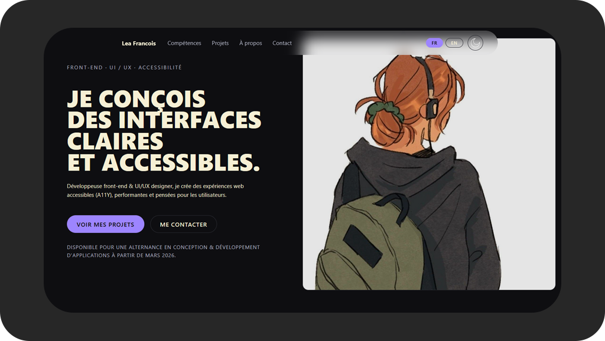

# Personal Portfolio — React + TypeScript

**Author:** Léa François  
**Project:** Portfolio V2 — Front-End • UI/UX • Accessibility (A11Y)  
**Tech Stack:** React • TypeScript • CSS • i18n

  

---

## About the project

This portfolio is a complete redesign of my professional online presence.  
It showcases my projects, my skills, and my visual identity as a front-end developer and UI/UX designer.

The main goal was to create a modern, accessible (A11Y-ready) and responsive website built entirely with **React and TypeScript**, following clean architecture principles and a user-centered design approach.

---

## Features

### Full bilingual interface (FR / EN)
- Automatic language persistence  
- Smooth text transitions  
- Content fully managed with `react-i18next`

### Smooth UI & UX interactions
- Scroll-reveal animations  
- Accessible modal for project details  
- Keyboard-friendly navigation  
- Safe external link handling (`noopener noreferrer`)

### Modular components & clean architecture
- Bento-style skills grid  
- Fully typed components (TypeScript)  
- Reusable cards (Projects, Skills)  
- JSON-driven multilingual content (no hardcoded text)

### Responsive & adaptive design
- Mobile-first layout  
- Modern CSS with custom animations  
- Consistent design across all sections

---

## Tech Stack

| Technology | Role |
|------------|------|
| **React** | UI Architecture |
| **TypeScript** | Typing & strictness |
| **CSS** | Styling & animations |
| **react-i18next** | Internationalization (FR/EN) |
| **Vite** | Build tool |
| **Biome** | Linting, formatting & code quality  |
| **GitHub Pages / OVH** | Deployment & hosting |

---

## Main challenges

- Creating a **fully typed architecture** using TypeScript  
- Managing multilingual content without code duplication  
- Designing an elegant Bento-style skills grid  
- Implementing smooth animations without compromising accessibility  
- Building accessible modals and interactive components from scratch  

---

## What I learned

- Structuring a scalable React application  
- Designing reusable and clean UI components  
- Applying accessibility best practices (A11Y)  
- Managing i18n with `react-i18next`  
- Organizing front-end architecture efficiently  
- Creating animations that stay lightweight & inclusive  

---

## Live website

- https://leafrancois.com/

